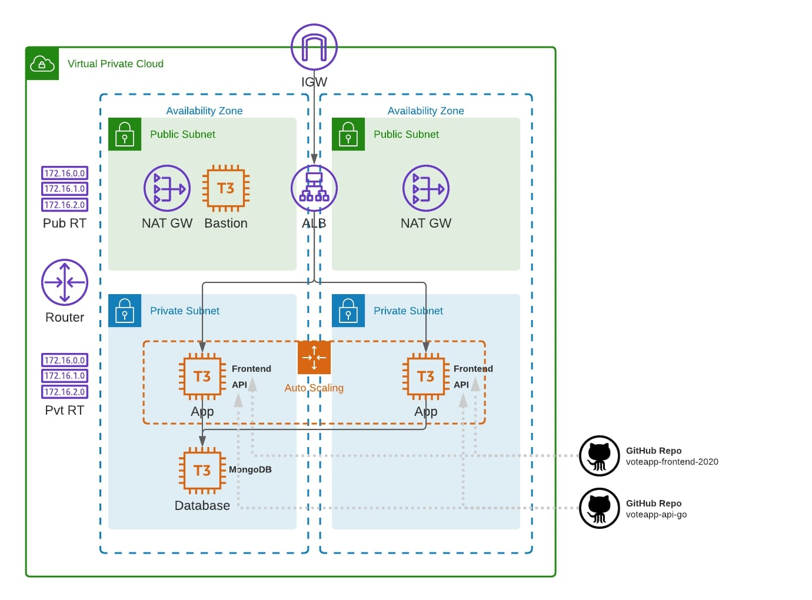

## Terraform project 1
- Description: Terraform project with AWS provider
- Idea: https://github.com/cloudacademy/terraform-aws/tree/main/exercises/exercise4
- Version terraform: ~> 1.7.0
- Version hashicorp/aws: ~> 5.40.0
- infrastructure after creating resource:
    
## Start project
- Init project:
```sh
terraform init
```

- Using this command  to check plan of creating resource
```sh
terraform plan --var-file "./terraform.tfvars"
```

- Using this command to apply plan
```sh
terraform apply --var-file "./terraform.tfvars"
```

- Using this command to destroy all resource
```sh
terraform destroy --var-file "./terraform.tfvars"
```